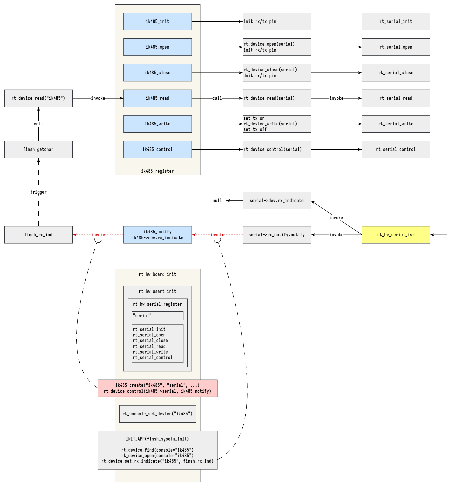

# ikun-485

ikun keep u naive.

ikun-485 making it easier to use 485 as a console. 😎



## API

### ik485_create

```
/**
 * tx_pin: switch rx/tx mode.
 * tx_lvl: choose high/low level for tx. 1=high, 0=low.
 * tx_dly: delay for a little while after switching to tx mode. (typically 10us.)
 */
ik485_device_t *ik485_create(const char *ik485_name, const char *serial_name,
                             rt_base_t tx_pin, rt_int32_t tx_lvl, rt_int32_t tx_dly);
```

### ik485_delete

```
rt_err_t ik485_delete(ik485_device_t *ik485);
```

## Example

```
#define RT_CONSOLE_DEVICE_NAME "ik485"


rt_hw_usart_init();
...
ik485_create(RT_CONSOLE_DEVICE_NAME, "uart1", GET_PIN(A, 0), 1, 10);
...
rt_console_set_device(RT_CONSOLE_DEVICE_NAME);
```

## Contact

- sulfurandcu@gmail.com
- https://github.com/sulfurandcu/ikun-485
